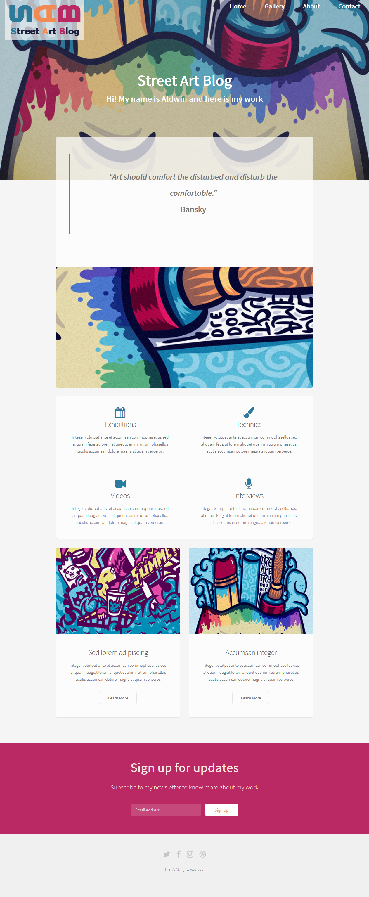

# Street-art-blog *(School project - RWD retrofitting)*

## Table of contents

- [Overview](#overview)
  - [Instructions](#instructions)
  - [Link](#link)
- [My process](#my-process)
  - [Built with](#built-with)

## Overview

### Instructions

Integration of a model in responsive web design using the principle of retrofitting.

Instructions in this [document](sources/Exercice_-_énoncé_-_responsive-retrofitting.pdf).

### Link

- Live Site URL: [Here](https://street-art-blog-janneso.vercel.app/)

## My process

### Built with

- Semantic HTML5 markup
- SCSS custom properties
- Flexbox
